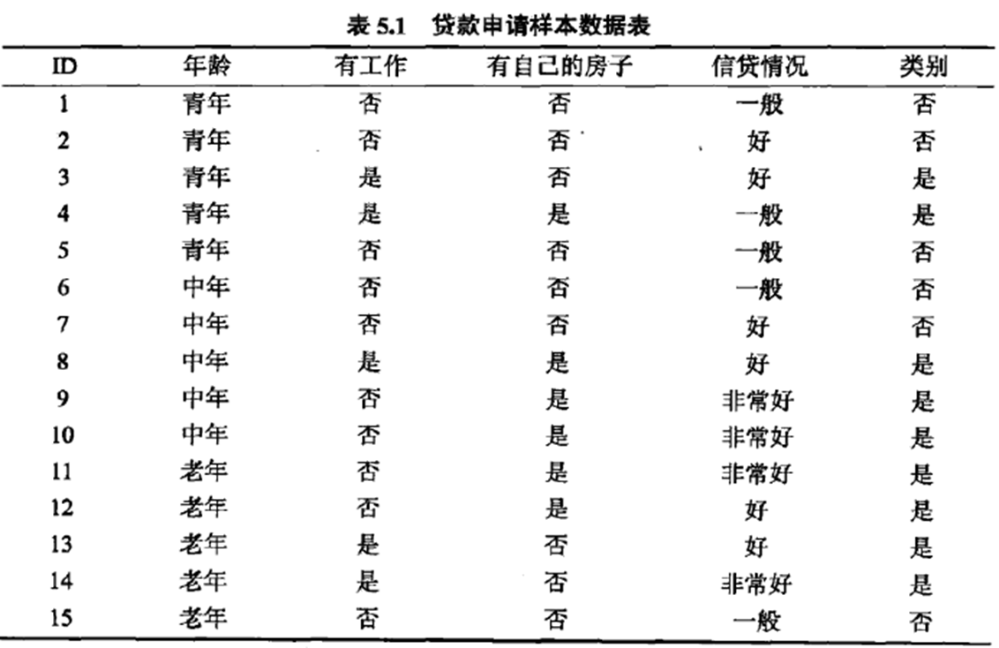

# 决策树

## 1 基本概念

**信息量**

度量一个事件的不确定性程度，不确定性越高则信息量越大，一般通过事件发生的概率来定义不确定性，信息量则是基于概率密度函数的log运算
$$
I(x)=-\log p(x)
$$
**信息熵**

衡量的是一个事件集合的不确定性程度，就是事件集合中所有事件的不确定性的期望
$$
\begin{aligned}
	H(x)&=E_{x\_X}[I(x)]\\
	&=E_{x\_X}[-\log p(x)]\\
	&=\sum_{x\in X}[-p(x)\log p(x)]
\end{aligned}
$$
**相对熵（KL散度）**

表示用于两个概率分布差异的非对称衡量，kl散度也可以从信息理论的角度出发，从这个角度出发的kl散度我们也可以称之为相对熵，实际上描述的是两个概率分布信息熵的差值 
$$
KL(P||Q)=\sum P(x)\frac{P(x)}{Q(x)}\\
$$
**交叉熵**

交叉熵就是真值分布的信息熵与KL散度的和，而真值的熵是确定的，与模型的参数θ 无关，所以梯度下降求导时，优化交叉熵和优化kl散度（相对熵）是一样的 
$$
H(p,q)=-\sum P\log Q
$$
**联合熵**

衡量的是两个事件集合，经过组合之后形成的新的大的事件集合的信息熵
$$
H(X,Y)=-\sum p(x,y) \log p(x,y)
$$
**条件熵**

事件集合Y的条件熵=联合熵-事件集合X的信息熵，用来衡量在事件集合X已知的基础上，事件集合Y的不确定性的减少程度
$$
H(Y|X)=-H(X,Y)-H(X)
$$

## 2 决策树原理

### 2.1 原理

决策树（Decision Tree）是一种非参数的有监督学习方法，他能从一系列有特征和标签的数据中总结出决策规则，并用树状图的结构来呈现这些规则，已解决分类和回归问题。

决策树的目标是建立一个可以用于决策的树结构，包含一个根节点和若干叶子节点和非叶子节点，叶子节点对应各个类别，非叶子节点对应一个属性值。

### 2.2 流程

1. 从根节点开始，计算每个特征的不纯度，选择不纯度最高的作为当前节点的分裂值
2. 根据当前分裂节点的值，将数据分成两部分，然后在分别建立左子树和右子树
3. 如果分裂前后的信息增益没有超过阈值，或者当前节点属于同一类别，则停止分裂

### 2.3 如何确定最佳分裂点

- ID3 - 信息增益

  计算分裂前后的信息增益，选择信息增益最大的作为当前最佳分裂特征。

  对于样本集合D，类别数为K，数据集D的经验熵表示为

  $$
  H(D)=-\sum_{k=1}^{K} \frac{\left|C_{k}\right|}{|D|} \log _{2} \frac{\left|C_{k}\right|}{|D|}
  $$

> 公式里为什么取对数？为什么取负数？
> 其实这是定义里规定的，取对数是为了在计算上方便，将乘法转换为加法计算；取负数是因为如何不包含负数，信息熵为负的，不符合我们的认知，即不确定性越高，信息熵应该越大。

​	其中$C_k$是样本集合D中属于第k类的样本子集，$|C_k|$表示该子集的元素个数，$|D|$表示样本集合的元素个数。

​	然后计算某个特征A对于数据集D的经验条件熵$H(D|A)$为

$$
H(D \mid A)=\sum_{i=1}^{n} \frac{\left|D_{i}\right|}{|D|} H\left(D_{i}\right)=\sum_{i=1}^{n} \frac{\left|D_{i}\right|}{|D|}\left(-\sum_{k=1}^{k} \frac{\left|D_{i k}\right|}{\left|D_{i}\right|} \log _{2} \frac{\left|D_{i k}\right|}{\left|D_{i}\right|}\right)
$$
​	其中，$D_i$表示D中特征A取第i个值的样本子集，$D_{ik}$表示$D_i$中属于第k类的样本子集。

​	于是信息增益$g(D,A)$可以表示为二者之差，可得

$$
g(D, A)=H(D)-H(D \mid A)
$$
​	`总结：ID3对特征值数目较多的特征有所偏好，且只能处理离散型数据；对缺失值敏感`

- C4.5 - 信息增益率

  特征A对于数据集D的信息增益比定义为

  $$
  g_{R}(D, A)=\frac{g(D, A)}{H_{A}(D)}
  $$
  其中
  
  $$
  H_{A}(D)=-\sum_{i=1}^{n} \frac{\left|D_{i}\right|}{|D|} \log _{2} \frac{\left|D_{i}\right|}{|D|}
  $$

​	`总结：C4.5使用信息增益率克服信息增益偏好特征数目多的特征，实际上是引入了特征的信息熵作为分母，来对高基数类别进行惩罚。所以C4.5对特征值数目较少的特征有所偏好，既可以处理离散型数据，也可以处理连续型数据，可以是多叉树。`

- CART - Gini指数

  Gini描述的是数据的纯度，与信息熵含义类似：

  $$
  \operatorname{Gini}(D)=1-\sum_{k=1}^{n}\left(\frac{\left|C_{k}\right|}{|D|}\right)^{2}
  $$
  CART在每一次迭代中选择基尼指数最小的特征及其对应的切分点进行分类。但与ID3、C4.5不同的是，CART是一颗二叉树，采用二元切割法，每一步将数据按特征A的取值切成两份，分别进入左右子树。特征A的Gini指数定义为
  
  $$
  \operatorname{Gini}(D \mid A)=\sum_{i=1}^{n} \frac{\left|D_{i}\right|}{|D|} \operatorname{Gini}\left(D_{i}\right)
  $$

​	`总结：CART既可以分类，也可以回归；既可以处理离散型数据也可以处理连续型数据；但只能是二叉树，分裂过的特征还可以再次分裂。`

### 2.4 什么情况停止分裂？

1. 分裂前后的信息增益小于给定的阈值
2. 当前节点的样本数小于给定的阈值
3. 当前节点的样本属于同一类别
4. 当树达到一定的深度时

### 2.5 怎么进行剪枝？

- 预剪枝：在训练过程中，如果分裂后的预测准确率变小了，则放弃分裂
- 后剪枝：先训练完整的一棵树，从叶子结点开始，计算一次准确率；去掉当前节点，再计算一次准确率，如果去掉当前节点之后准确率提升，则进行剪枝

### 2.6 决策树优缺点

**优点**

- 计算简单，容易解释
- 不用对数据进行归一化处理

**缺点**

- 一棵树容易过拟合
- 不稳定，微小的数据变化，会建立不同的决策树
- 使用贪心算法，保证局部最优，但不能保证全局最优

## 3 决策树案例

本章以CART树为例，讲述如何在真实数据集上建立决策树和回归树。

### 3.1 分类树

决策树算法是一种对高维数据进行有效分类的数据挖掘方法. 通过对输入的特征信息进行分析训练，构造决策树模型作为分类规则。

传统的CART树是一种应用广泛的决策树学习算法，主要通过计算基尼指数来选择最优特征，得到二叉树判断准则进行分类。

在分类问题中，假设有$K$个类，样本点属于第$k$类的概率为$p_k$，则概率分布的基尼指数定义为
$$
Gini(p) = \sum\limits_{k = 1}^K {{p_k}(1 - {p_k})}  = 1 - \sum\limits_{k = 1}^K {p_k^2}
$$
如果二分类问题，若样本点属于第一类的概率为$p$，则概率分布的基尼指数为
$$
Gini(p)=2p(1-p)
$$
对于样本$D$，个数为$|D|$，假设$K$个类别，第$k$个类别的数量为$C_k$，则样本$D$的基尼指数表达式为
$$
Gini(D) = 1 - \sum\limits_{k = 1}^K {({\frac{|C_k|}{|D|}})^2}
$$
对于样本$D$，个数为$|D|$，根据特征A的某个特征值，将$D$分成$D_l$和$D_r$，则在特征A的条件下，样本$D$的基尼系数表达式为
$$
Gini(D，A) = \frac{|D_l|}{|D|}Gini(D_l)+\frac{|D_r|}{|D|}Gini(D_r)
$$
**以贷款数据集为例**



如上表的贷款申请数据集，以$A_1，A_2，A_3，A_4$表示年龄，有工作，有自己的房子和信贷情况四个特征，并以1,2,3表示年龄的值为青年、中年和老年；以1,2表示有工作和有自己的房子中的是和否；以1,2,3表示信贷情况的值为非常好，好和一般。

​	求特征$A_1$的基尼指数
$$
Gini(D，A_1=1) = \frac{5}{15}(2\times\frac{2}{5}\times(1-\frac{2}{5}))+\frac{10}{15}(2\times\frac{7}{10}\times(1-\frac{7}{10}))=0.44
$$

$$
Gini(D，A_1=2) = \frac{5}{15}(2\times\frac{3}{5}\times(1-\frac{3}{5}))+\frac{10}{15}(2\times\frac{6}{10}\times(1-\frac{6}{10}))=0.48
$$

$$
Gini(D，A_1=3) = \frac{5}{15}(2\times\frac{4}{5}\times(1-\frac{4}{5}))+\frac{10}{15}(2\times\frac{5}{10}\times(1-\frac{5}{10}))=0.44
$$

由于$Gini(D,A_1=1)$和$Gini(D,A_1=3)$相等，且最小，所以$A_1=1$和$A_1=3$都以作为$A_1$的最佳分裂点。

​	求特征$A_2，A_3$的基尼指数：
$$
Gini(D，A_2=1) = 0.32
$$

$$
Gini(D，A_3=1) = 0.27
$$

​	由于$A_2，A_3$只有一个切分点，所以他们就是最佳分裂点。

​	求特征$A_4$的基尼指数：
$$
Gini(D，A_4=1) = 0.36
$$

$$
Gini(D，A_4=2) = 0.47
$$

$$
Gini(D，A4=3) = 0.32
$$

​	由于$Gini(D,A_4=3)$最小，所以$A_4=3$都以作为$A_4$的最佳分裂点。

​	在$A_1，A_2，A_3，A_4$四个特征中，$Gini(D，A_3=1) = 0.27$最小，所以选择特征$A_3$为最优特征，$A_3=1$为最佳分裂点。按$A_3=1$将数据集分成两部分，于是根节点生成两个子节点。然后在两个子节点继续使用上述方法在$A_1，A_2，A_4$中选择最优特征及其最佳分裂点。

​	重复上述步骤，直到所有节点都为叶节点为止。

### 3.2 回归树

如果数据集的标签是一系列连续值的集合，就不能再使用基尼指数作为划分树的指标。

在回归问题中我们可以发现，对于连续数据，当数据分布比较分散时，各个数据与平均数的差的平方和较大，方差就较大；

当数据分布比较集中时，各个数据与平均数的差的平方和较小。

方差越大，数据的波动越大；方差越小，数据的波动就越小。

因此，对于连续的数据，可以使用样本与平均值的差的平方和作为划分回归树的指标。
$$
\begin{array}{l}
\begin{array}{ccccccccccc}
\hline x_{i} & 1 & 2 & 3 & 4 & 5 & 6 & 7 & 8 & 9 & 10 \\
\hline y_{i} & 5.56 & 5.70 & 5.91 & 6.40 & 6.80 & 7.05 & 8.90 & 8.70 & 9.00 & 9.05 \\
\hline
\end{array}
\end{array}
$$
如上表所示为训练数据集，$x$的取值范围是[0.5,10.5]，$y$的取值范围是[5.0,10.0]，训练回归树模型。

首先通过优化问题
$$
\min _{s}\left[\min _{c_{1}} \sum_{x_{i} \in R_{1}}\left(y_{i}-c_{1}\right)^{2}+\min _{c_{2}} \sum_{x_{i} \in R_{2}}\left(y_{i}-c_{2}\right)^{2}\right]
$$
求解训练数据的切分点$s$;

其中
$$
R_{1}=\{x \mid x \leqslant s\}, \quad R_{2}=\{x \mid x>s\}
$$
容易求得在$R_1,R_2$内使平方损失误差达到最小值的$c_1，c_2$为
$$
c_{1}=\frac{1}{N_{1}} \sum_{x_{i} \in R_{1}} y_{i}, \quad c_{2}=\frac{1}{N_{2}} \sum_{x_{i} \in R_{2}} y_{i}
$$
这里$N_1，N_2$是$R_1,R_2$的样本个数。

求训练数据的切分点，根据所给数据，考虑如下切分点：1.5，2.5，3.5，4.5，5.5，6.5，7.5，8.5，9.5

对各切分点，不难求出相应的$R_1,R_2，c_1，c_2$及
$$
m(s)=\min _{a} \sum_{x_{i} \in R_{1}}\left(y_{i}-c_{1}\right)^{2}+\min _{c_{2}} \sum_{x_{i} \in R_{2}}\left(y_{i}-c_{2}\right)^{2}
$$
例如，当 $s = 1.5$ 时， $R_{1}=\{1\}, R_{2}=\{2,3, \cdots, 10\}, c_{1}=5.56, c_{2}=7.50$ ，
$$
m(s)=\min _{c_{1}} \sum_{x_{i} \in R_{1}}\left(y_{i}-c_{1}\right)^{2}+\min _{c_{2}} \sum_{x_{i} \in R_{2}}\left(y_{i}-c_{2}\right)^{2}=0+15.72=15.72
$$
得到所有的s取值和对应的m(s)，结果如下：
$$
\begin{array}{l}
\begin{array}{cccccccccc}
\hline s & 1.5 & 2.5 & 3.5 & 4.5 & 5.5 & 6.5 & 7.5 & 8.5 & 9.5 \\
\hline m(s) & 15.72 & 12.07 & 8.36 & 5.78 & 3.91 & 1.93 & 8.01 & 11.73 & 15.74 \\
\hline
\end{array}
\end{array}
$$
由上表所示，当s=6.5时，m(s)达到最小值，所以s=6.5为最佳分裂点。

## 4 python实现决策树

### **4.1 建立一颗决策树**

**步骤**

> 1. 实例化，建立评估模型对象
> 2. 通过模型接口训练模型
> 3. 通过模型接口获得需要的信息

**sklearn中的决策树**

> 1. 八个参数：Criterion, 两个随机性相关的参数（random_state, splitter），
>    五个剪枝参数（max_depth, min_samples_split，min_samples_leaf，max_feature，min_impurity_decrease）
> 2. 一个属性：feature_importances_
> 3. 四个接口：fit, score, apply, predict

**代码**

```python
def buildTree():
    # 加载红酒数据集
    wine = load_wine()
    print(wine.data.shape)

    print(wine.target)

    # 将wine整理成一张表
    pd.concat([pd.DataFrame(wine.data), pd.DataFrame(wine.target)], axis=1)
    print(wine.feature_names)
    print(wine.target_names)

    # 划分训练集和测试集
    Xtrain, Xtest, Ytrain, Ytest = train_test_split(wine.data, wine.target, test_size=0.3)
    print(Xtrain.shape)
    print(Xtest.shape)

    # 建立模型
    # random_state 用来设置分支中的随机模式的参数； splitter用来控制决策树中的随机选项
    # max_depth 限制树的最大深度；min_samples_leaf & min_samples_split 一个节点在分之后的每个子节点最少包含多少个训练样本
    clf = tree.DecisionTreeClassifier(criterion="entropy", random_state=30)
    clf.fit(Xtrain, Ytrain)
    score = clf.score(Xtest, Ytest)
    print(score)

    # 画出一棵树
    import graphviz
    feature_name = wine.feature_names
    dot_data = tree.export_graphviz(clf, feature_names=feature_name, class_names=['class_0', 'class_1', 'class_2'],
                                    filled=True, rounded=True)
    graph = graphviz.Source(dot_data)
    print(graph)

    # 探索决策树的特征重要性
    print(clf.feature_importances_)
    feature_importance = [*zip(feature_name, clf.feature_importances_)]
    print(feature_importance)

    # apply（）返回每个测试样本所在的叶子节点的索引
    print(clf.apply(Xtest))
    # predict（）返回每个测试样本的分类结果:返回的是一个大小为n的一维数组，一维数组中的第i个值为模型预测第i个预测样本的标签
    print(clf.predict(Xtest))
    # predict_proba返回的是一个n行k列的数组，第i行第j列上的数值是模型预测第i个预测样本的标签为j的概率。此时每一行的和应该等于1
    print(clf.predict_proba(Xtest))
```

### 4.2 通过网格搜索确定最优的剪枝参数

```python
def max_parameter(Xtrain, Ytrain, Xtest, Ytest):
    test = list()
    for i in range(10):
        clf = tree.DecisionTreeClassifier(max_depth=i + 1, criterion="entropy", random_state=30, splitter="random")
        clf = clf.fit(Xtrain, Ytrain)
        score = clf.score(Xtest, Ytest)
        test.append(score)

    plt.plot(range(1, 11), test, color="red", label="max_depth")
    plt.legend()
    plt.show()
```

### 4.3 K折交叉验证

```python
def cross_val():
    """
    K折交叉验证
    :return:
    """
    from sklearn.datasets import load_boston
    from sklearn.model_selection import cross_val_score
    from sklearn.tree import DecisionTreeRegressor
    boston = load_boston()
    regressor = DecisionTreeRegressor(random_state=0)
    val_score = cross_val_score(regressor, boston.data, boston.target, cv=10, scoring="neg_mean_squared_error")
    print(val_score)
```

### 4.4 泰坦尼克号生还者预测

```python
def titanic_example():
    import pandas as pd
    from sklearn.tree import DecisionTreeClassifier
    from sklearn.model_selection import train_test_split
    from sklearn.model_selection import GridSearchCV
    from sklearn.model_selection import cross_val_score
    import matplotlib.pyplot as plt
    import numpy as np

    data = pd.read_csv(r"data.csv", index_col=0)
    print(data.head())
    print(data.info())

    # 删除缺失值过多的列，和观察判断来说和预测的y没有关系的列
    data.drop(["Cabin", "Name", "Ticket"], inplace=True, axis=1)

    # 处理缺失值，对缺失值较多的列进行填补，有一些特征只确实一两个值，可以采取直接删除记录的方法
    data["Age"] = data["Age"].fillna(data["Age"].mean())
    data = data.dropna()

    # 将二分类变量转换为数值型变量
    # astype能够将一个pandas对象转换为某种类型，和apply(int(x))不同，astype可以将文本类转换为数字，用这个方式可以很便捷地将二分类特征转换为0~1
    data["Sex"] = (data["Sex"] == "male").astype("int")

    # 将三分类变量转换为数值型变量
    labels = data["Embarked"].unique().tolist()
    data["Embarked"] = data["Embarked"].apply(lambda x: labels.index(x))

    # 查看处理后的数据集
    print(data.head())

    # 提取标签和特征矩阵， 分测试集和训练集
    X = data.iloc[:, data.columns != "Survived"]
    y = data.iloc[:, data.columns == "Survived"]

    Xtrain, Xtest, Ytrain, Ytest = train_test_split(X, y, test_size=0.3)

    # 修正测试集和训练集的索引
    for i in [Xtrain, Xtest, Ytrain, Ytest]:
        i.index = range(i.shape[0])

    # 查看分好的训练集和测试集
    print(Xtrain.head())

    # 建立模型
    clf = DecisionTreeClassifier(random_state=25)
    clf = clf.fit(Xtrain, Ytrain)
    score_ = clf.score(Xtest, Ytest)
    print(score_)
    score = cross_val_score(clf, X, y, cv=10).mean()
    print(score)

    # 在不同max_depth下观察模型的拟合状况
    tr = []
    te = []
    for i in range(10):
        clf = DecisionTreeClassifier(random_state=25
                                     , max_depth=i + 1
                                     , criterion="entropy"
                                     )
        clf = clf.fit(Xtrain, Ytrain)
        score_tr = clf.score(Xtrain, Ytrain)
        score_te = cross_val_score(clf, X, y, cv=10).mean()
        tr.append(score_tr)
        te.append(score_te)
    print(max(te))
    plt.plot(range(1, 11), tr, color="red", label="train")
    plt.plot(range(1, 11), te, color="blue", label="test")
    plt.xticks(range(1, 11))
    plt.legend()
    plt.show()

    # 用网格搜索调整参数
    gini_thresholds = np.linspace(0, 0.5, 20)

    parameters = {'splitter': ('best', 'random')
        , 'criterion': ("gini", "entropy")
        , "max_depth": [*range(1, 10)]
        , 'min_samples_leaf': [*range(1, 50, 5)]
        , 'min_impurity_decrease': [*np.linspace(0, 0.5, 20)]}

    clf = DecisionTreeClassifier(random_state=25)
    GS = GridSearchCV(clf, parameters, cv=10)
    GS.fit(Xtrain, Ytrain)

    print(GS.best_params_)
    print(GS.best_score_)
```

**参考文献**

[^1]:统计学习方法.李航。2012.03.清华大学出版社